# 7. Expose CICS Application data through z/OS Connect

- ## Creating a Service

  - Switch to the z/OS Connect Enterprise Edition perspective in your Eclipse environment.

    - From the main menu, select **Window > Open Perspective > Other**. The Select Perspective wizard opens.

    - Select **z/OS Connect Enterprise Edition**.

  - Select **File > New > Project**. The New Project wizard opens.

  - Select **z/OS Connect Enterprise Edition > z/OS Connect EE Service Project**, and click **Next**.

  - Specify a project name, select the project type, and optionally provide a description.

    - Select **CICS COMMAREA Service** for the project type.

  - Click **Finish** to create the project.   The service project is created in the Project Explorer view. The service.properties file opens in the service project editor in a tab that is named after the service project. This service project editor is where you can configure the service and define the service interface. Initially, errors () are reported and highlighted for information that is required and must be specified. Depending on the service type, required information varies.   _The service project editor_     The **Actions** pane highlights the steps to create a service.

  - In the service project editor, take the following steps:

    - Optionally, change the version number from the default of 1.0.0.

    - Specify the program for CICS.

    - Define the request and response service interfaces. The service interfaces are defined by importing COBOL copybooks,PL/I include files, or full programs and customizing the interfaces. For more information, see [Defining the request and response service interfaces](https://www.ibm.com/support/knowledgecenter/SS4SVW_3.0.0/designing/service_compose_interface.html?view=kc).

    - Select the service interface file to use for the **Request service interface** field.

    - Select the service interface file to use for the **Response service interface** field.

    - Optionally, specify initialization, conversion, and omission options for your data by clicking **Advanced Options**.   For more information, see [Service-level data conversion customization](https://www.ibm.com/support/knowledgecenter/SS4SVW_3.0.0/designing/service_advancedmapping.html?view=kc).

    - Click the **Configuration** tab to configure subsystem-specific service properties. For more information see [Configuring service properties](https://www.ibm.com/support/knowledgecenter/SS4SVW_3.0.0/designing/service_specify_properties.html?view=kc).

    - Save your changes.

    - After validation that all required information is specified, the JSON schema files and the service XML file are created in the service project folder. To edit the service project at a later time, open the service project editor by double-clicking the service.properties file in the project folder within the Project Explorer view.

* ## IPIC Connection Configuration

  - Define a TCPIPService to listen for inbound IPIC requests in your CICS region. This scenario uses a port value of 1091. For more information about defining a TCPIPService for inbound IPIC requests, see [Configuring the IPIC connection](https://www.ibm.com/support/knowledgecenter/SSGMCP_5.4.0/applications/developing/java/dfhpj2_jca_remote_eci_ipicconfig.html) in the _CICS Transaction Server_ documentation.

  - Use the following command to create a server:

    - `zosconnect create catalogManager --template=zosconnect:sampleCicsIpicCatalogManager`

  - The following artifacts are created:

    - A catalog API service archive file, catalog.aar, in the directory \<WLP_USER_DIR>/servers/catalogManager/resources/zosconnect/apis.

    - Three services archive files, inquireCatalog.sar, inquireSingle.sar, and placeOrder.sar, in the directory \<WLP_USER_DIR>/servers/catalogManager/resources/zosconnect/services.

    - A server.xml configuration file in the directory \<WLP_USER_DIR>/servers/catalogManager with the zosconnect:cicsService-1.0 feature included.

  - Customize the z/OS Connect EE server configuration file.

    - Update the CICS connection element: \<zosconnect_cicsIpicConnection id="cicsConn" host="localhost" port="1091"/>

      - If your server and CICS region are on different LPARs, replace the host value localhost with the host name or IP address of the LPAR hosting your CICS region.

      - Replace the port value 1234 with the port that your CICS TCPIPService is configured to listen for inbound IPIC requests. This scenario uses port 1091.

    - Update the httpPort for inbound connections into z/OS Connect EE in the following element, if necessary:  
      \<httpEndpoint id="defaultHttpEndpoint" host="\*" httpPort="9080" httpsPort="-1"/>

    - Enable security if required.

* ## [Test the IPIC Connection](https://www.ibm.com/support/knowledgecenter/SS4SVW_3.0.0/scenarios/cics_connection_test.html?view=kc)

  - You can test your connection to your CICS region by invoking the catalog API directly from z/OS Connect EE API toolkit by using the "Try it out!" function in the Swagger UI that is embedded in the editor.

- ## Create a CICS service

  - Start IBM® Explorer for z/OS and open the z/OS Connect Enterprise Edition perspective.

  - Right click in the project explorer window and select **File > New... > Project**. Select the **z/OS Connect EE Service Project** wizard.

  - Fill in the sections for the new service project and click **Finish**.  
    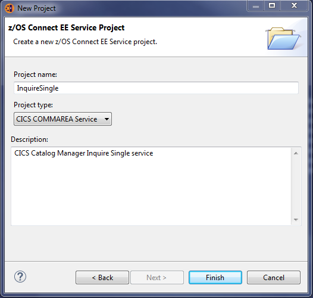

  - The z/OS Connect EE Service Project Editor dialog opens. Add the program name DFH0XCMN to the program: input area, as shown.  
    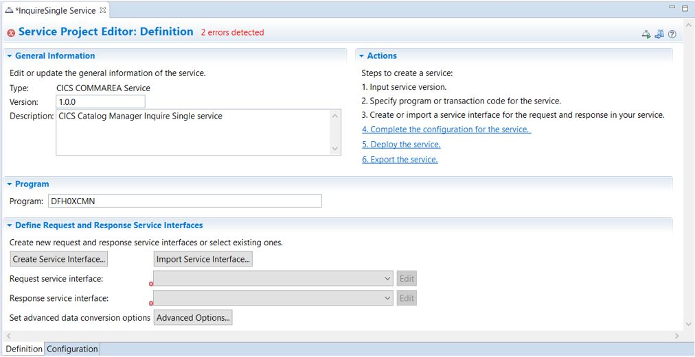

  - Click the **Configuration** tab at the bottom of the screen.   Add the connection reference cicsConn  
    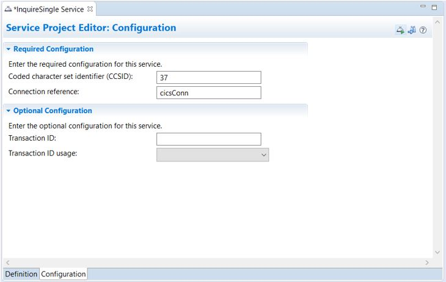

  - Click the **Definition** tab at the bottom of the screen.

  - Click **Create Service Interface**.   Add the service interface name DFH0XCP4 and click **OK**. 
    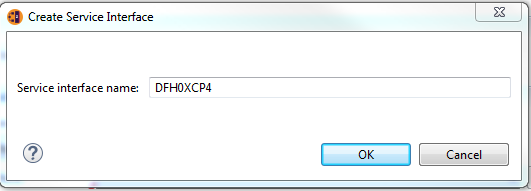  
    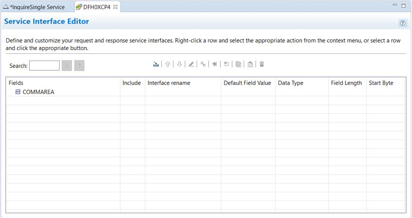

  - You have created a new service interface file. In the Service Interface editor, click **Import COBOL or PLI data Structures into the service interface** .

  - Locate the DFH0XCP4 COBOL copybook and import it from the file system. To import the copybook directly from your CICS installation, select **z/OS system** from the **Import from:** list and locate the copybook from the **Source PDS:** list. If the copybook is on your local workstation, select **Local file system** from the **Import from:** list and locate the copybook from the **Source folder:** list.  
    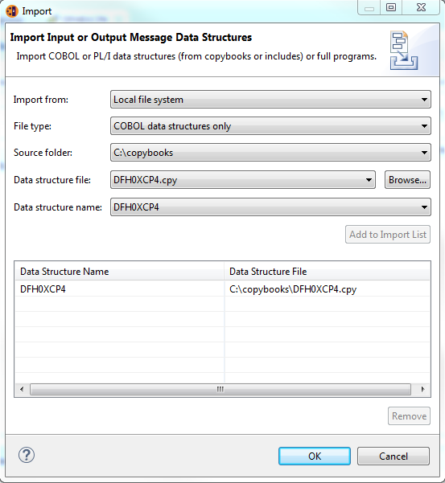

  - Click **Add to Import List** to import the DFH0XCP4 data structure from the copybook, and click **OK**.  
    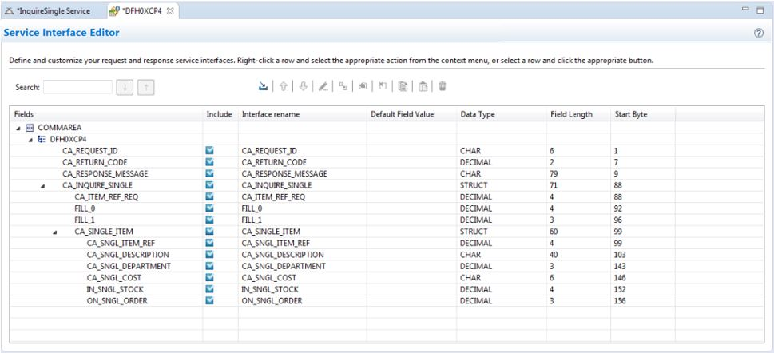

  - Unselect the Include checkboxes for FILL_0 and FILL_1 to hide these fields from the user of the service as they are for internal use by the CICS application.

  - Save your changes to the service interface DFH0XCP4.

  - Click **Definition** tab for the inquireSingle service. As there is only one service interface file, **DFH0XCP.si** in the service interfaces folder for this project, it is automatically selected in the **Request service interface** and **Response service interface** fields.  
    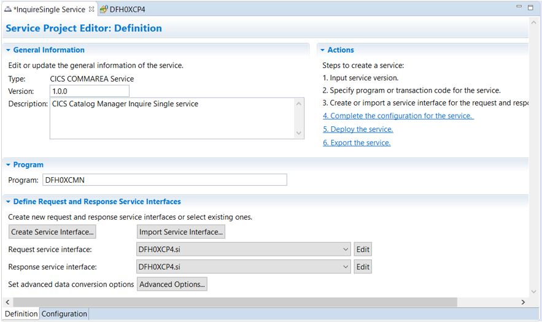  
    Save the InquireSingle service.

  - Right click inquireSingle in the Project Explorer view. Click **z/OS Connect EE > Export z/OS Connect EE Service Archive**.  
    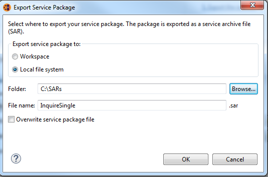

  - Click **Browse** to select the directory where you want to save the service archive file and click **OK**.

  - The InquireSingle service archive file inquireSingle.sar is now ready to be deployed.

- ## Deploy the CICS catalog manager service using the API toolkit

  - In the Project Explorer view, right-click the service project and select **z/OS Connect EE > Deploy Service to z/OS Connect EE Server**. If you already have the service installed, perhaps by using the sampleCicsIpicCatalogManager template, you can select the Overwrite check box, or Stop and Remove the service before deploying your new one.

- ## Test the CICS HCAZ service

  - Start CICS® and ensure that the TCPIPService is open.

  - Start your z/OS Connect EE server. For more information, see [Starting and stopping z/OS Connect EE](https://www.ibm.com/support/knowledgecenter/SS4SVW_3.0.0/operating/start_stop_server.html?view=kc).

    - Check the messages.log file for the following messages that confirm that the services are installed.

      - `BAQR7043I: z/OS Connect EE service archive placeOrder installed successfully.`
      - `BAQR7043I: z/OS Connect EE service archive inquireSingle installed successfully.`
      - `BAQR7043I: z/OS Connect EE service archive inquireCatalog installed successfully.`

    - Check the messages.log file for the following messages that confirm that the API is installed.

      - `BAQR7000I: z/OS Connect API package catalog installed successfully.`

  - In the z/OS Connect EE Servers view under the **APIs** folder, double-click on the catalog API.   The API is opened in the Swagger UI.

  - Click **List Operations** to see available operations in the API.  
    _Operations in the API_  
    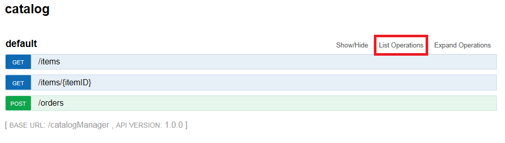

  - Test inquiring on an item by clicking **GET /items/{itemID}**.

    - Specify a value of 10 for the itemID.
      _Testing the GET request_
      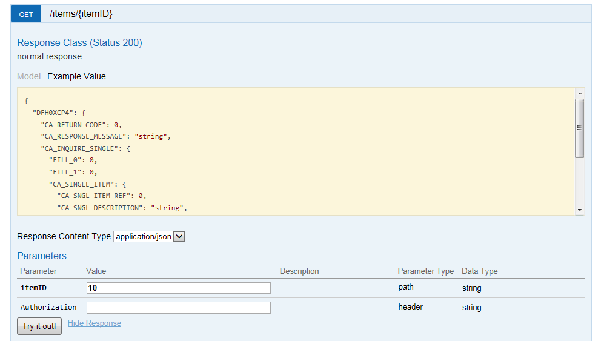

    - Click Try it out!.   Information about the request URL, request headers, response body, response code, and response headers are provided. The response body contains the output message:
      -"CA_SNGL_DESCRIPTION": "Ball Pens Black 24pk"

    - You have verified that your newly created inquireSingle service works to CICS.
