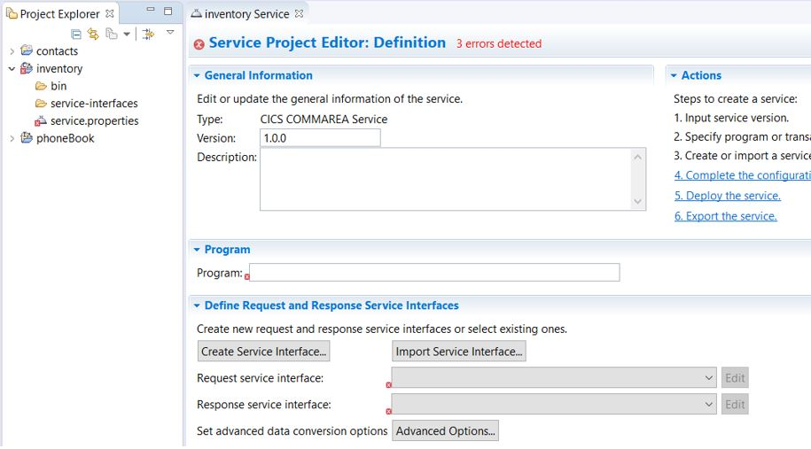

# 7. Expose CICS Application data through z/OS Connect

- ## Creating a Service

  - Switch to the z/OS Connect Enterprise Edition perspective in your Eclipse environment.

    - From the main menu, select **Window > Open Perspective > Other**. The Select Perspective wizard opens.

    - Select **z/OS Connect Enterprise Edition**.

  - Select **File > New > Project**. The New Project wizard opens.

  - Select **z/OS Connect Enterprise Edition > z/OS Connect EE Service Project**, and click **Next**.

  - Specify a project name, select the project type, and optionally provide a description.

    - Select **CICS COMMAREA Service** for the project type.

  - Click **Finish** to create the project.   The service project is created in the Project Explorer view. The service.properties file opens in the service project editor in a tab that is named after the service project. This service project editor is where you can configure the service and define the service interface. Initially, errors () are reported and highlighted for information that is required and must be specified. Depending on the service type, required information varies.   _The service project editor_     The **Actions** pane highlights the steps to create a service.

  - In the service project editor, take the following steps:

    - Optionally, change the version number from the default of 1.0.0.

    - Specify the program for CICS.

    - Define the request and response service interfaces. The service interfaces are defined by importing COBOL copybooks,PL/I include files, or full programs and customizing the interfaces. For more information, see [Defining the request and response service interfaces](https://www.ibm.com/support/knowledgecenter/SS4SVW_3.0.0/designing/service_compose_interface.html?view=kc).

* ## IPIC Connection Configuration

  - Define a TCPIPService to listen for inbound IPIC requests in your CICS region. This scenario uses a port value of 1091. For more information about defining a TCPIPService for inbound IPIC requests, see [Configuring the IPIC connection](https://www.ibm.com/support/knowledgecenter/SSGMCP_5.4.0/applications/developing/java/dfhpj2_jca_remote_eci_ipicconfig.html) in the _CICS Transaction Server_ documentation.

  - Use the following command to create a server:

    - `zosconnect create catalogManager --template=zosconnect:sampleCicsIpicCatalogManager`

  - The following artifacts are created:

    - A catalog API service archive file, catalog.aar, in the directory \<WLP_USER_DIR>/servers/catalogManager/resources/zosconnect/apis.

    - Three services archive files, inquireCatalog.sar, inquireSingle.sar, and placeOrder.sar, in the directory \<WLP_USER_DIR>/servers/catalogManager/resources/zosconnect/services.

    - A server.xml configuration file in the directory \<WLP_USER_DIR>/servers/catalogManager with the zosconnect:cicsService-1.0 feature included.

  - Customize the z/OS Connect EE server configuration file.

    - Update the CICS connection element: \<zosconnect_cicsIpicConnection id="cicsConn" host="localhost" port="1091"/>

      - If your server and CICS region are on different LPARs, replace the host value localhost with the host name or IP address of the LPAR hosting your CICS region.

      - Replace the port value 1234 with the port that your CICS TCPIPService is configured to listen for inbound IPIC requests. This scenario uses port 1091.

    - Update the httpPort for inbound connections into z/OS Connect EE in the following element, if necessary:  
      \<httpEndpoint id="defaultHttpEndpoint" host="\*" httpPort="9080" httpsPort="-1"/>

    - Enable security if required.

* ## Test the IPIC Connection

  -
