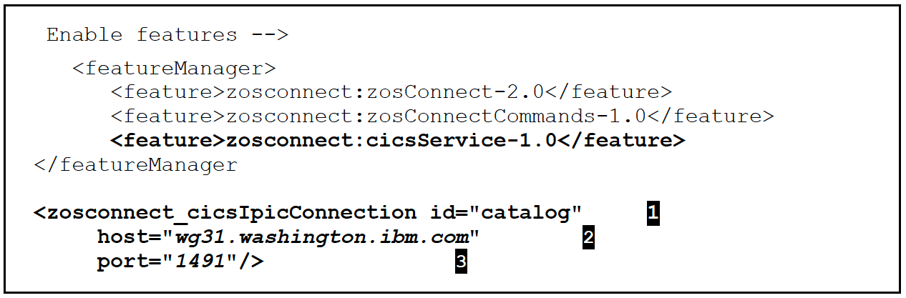

# 7. Expose CICS Application data through z/OS Connect

- Connectivity between the z/OS Connect EE (zCEE) server and a CICS region is provided by CICS _IP Interconnectivity_ (IPIC). Further CICS configuration may be required.  
  In the sample application that will be shown, the CICS region is running on TCP/IP host
  _wg31.washington.ibm.com_ and has an IPIC TCPIPService listening on port _1491_. The z/OS Connect EEserver is running on the same TCP/IP host and is listening on port _9443_ for HTTPS requests.

- ## Adding IPIC support to a z/OS Connect server

  - Go to the server.xml directory, e.g. /var/zosconnect/servers/\<serverName>

  - Edit server.xml and add the lines highlighted here in bold as shown, see the notes below:
    

    - _Notes:_

      1. This value must match the value that is specified for the _connectionRef_ property when a _service_ is developed in the API Toolkit.

      2. The TCP/IP host name or IP address of the host on which the CICS region is running.

      3. The port assigned to the IPIC TCPIPService defined in the CICS region.

    - Save the file.

- ## Setup of IPIC support in a CICS region

  - Adding support for IPIC in a CICS region is quite simple. First, the CICS region must have:

    - TCPIP=YES and
    - ISC=YES

    Specified as system initialization parameters at CICS startup.

  - Finally, a CICS _TCPIPService_ needs to be defined and installed in the CICS region. This resource identifies which port the CICS region will listen on for inbound IPIC requests.

  - This resource should have these attributes:

    | **TCPIPService resource attribute** | **Value required**                              |
    | :---------------------------------- | :---------------------------------------------- |
    | URM                                 | DFHISAIP                                        |
    | Port Number                         | A numeric value of an available port, e.g. 1491 |
    | Status                              | OPEN                                            |
    | Protocol                            | IPIC                                            |
    | Transaction                         | CISS                                            |

- ## Developing RESTful Services for CICS

  - Once the IPIC configuration is completed follow the instructions for the development and deployment of services in the Developing RESTful APIs for CICS document at URL [https://github.com/ibmwsc/zCONNEE-Wildfire-Workshop](https://github.com/ibmwsc/zCONNEE-Wildfire-Workshop). This document shows how to develop and deploy CICS services as well as showing how to develop and deploy APIs that consume these services. For the purposes of this document we are only interested in deploying and testing services, but feel free to develop and test APIs also.

- ## Test the Services

  - If you have followed the instructions in Developing RESTful APIs for CICS you should have at least 3 services deployed to the server. These services are inquireSingle, inquireCatalog and placeOrder. The services can be used to test connectivity to CICS from the z/OS Connect server. The services and infrastructure should be tested before developing an API to ensure the infrastructure and the request and response messages are as expected.
