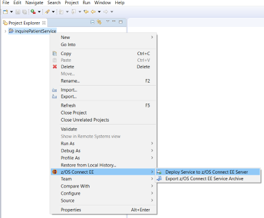
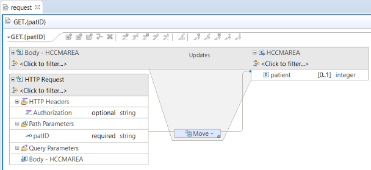

# 7. Expose CICS Application data through z/OS Connect

* ## IPIC Connection Configuration

  - Define a TCPIPService to listen for inbound IPIC requests in your CICS region. This scenario uses a port value of 1091. For more information about defining a TCPIPService for inbound IPIC requests, see [Configuring the IPIC connection](https://www.ibm.com/support/knowledgecenter/SSGMCP_5.4.0/applications/developing/java/dfhpj2_jca_remote_eci_ipicconfig.html) in the _CICS Transaction Server_ documentation. 

  - The following artifacts are needed:

    - A server.xml configuration file with the zosconnect:cicsService-1.0 feature included.

  - Customize the z/OS Connect EE server configuration file.

    - Update the CICS connection element: \<zosconnect_cicsIpicConnection id="yourConnName" host="localhost" port="1234"/>

      - If your server and CICS region are on different LPARs, replace the host value localhost with the host name or IP address of the LPAR hosting your CICS region.

      - Replace the port value 1234 with the port that your CICS TCPIPService is configured to listen for inbound IPIC requests. This scenario uses port 1091.

    - Update the httpPort for inbound connections into z/OS Connect EE in the following element, if necessary:  
      \<httpEndpoint id="defaultHttpEndpoint" host="\*" httpPort="9080" httpsPort="-1"/>

    - Enable security if required.
    
   - Additional instruction may also be found in the CICS RESTful APIs section of the [Getting Started Guide](https://www-03.ibm.com/support/techdocs/atsmastr.nsf/WebIndex/WP102724)

- ## Creating a CICS Service

  - Switch to the z/OS Connect Enterprise Edition perspective in your Eclipse environment.

    - From the main menu, select **Window > Open Perspective > Other**. The Select Perspective wizard opens.

    - Select **z/OS Connect Enterprise Edition**.

  - Select **File > New > Project**. The New Project wizard opens.
  
        

  - Select **z/OS Connect Enterprise Edition > z/OS Connect EE Service Project**, and click **Next**.

  - Specify a project name, select the project type, and optionally provide a description.
  
        

    - Select **CICS COMMAREA Service** for the project type.

  - Click **Finish** to create the project.   The service project is created in the Project Explorer view. The service.properties file opens in the service project editor in a tab that is named after the service project. This service project editor is where you can configure the service and define the service interface. Initially, errors () are reported and highlighted for information that is required and must be specified. Depending on the service type, required information varies.   _The service project editor_      The **Actions** pane highlights the steps to create a service.

  - In the service project editor, take the following steps:

    - Optionally, change the version number from the default of 1.0.0.

    - Specify the program for CICS.

    - Define the request and response service interfaces. The service interfaces are defined by importing COBOL copybooks,PL/I include files, or full programs and customizing the interfaces. For more information, see [Defining the request and response service interfaces](https://www.ibm.com/support/knowledgecenter/SS4SVW_3.0.0/designing/service_compose_interface.html?view=kc).

    - Create/Select the service interface file to use for the **Request service interface** field.

    - Create/select the service interface file to use for the **Response service interface** field.
    
     - Optionally, specify initialization, conversion, and omission options for your data by clicking **Advanced Options**.   For more information, see [Service-level data conversion customization](https://www.ibm.com/support/knowledgecenter/SS4SVW_3.0.0/designing/service_advancedmapping.html?view=kc).

    - Click the **Configuration** tab to configure subsystem-specific service properties. For more information see [Configuring service properties](https://www.ibm.com/support/knowledgecenter/SS4SVW_3.0.0/designing/service_specify_properties.html?view=kc).

    - Save your changes.
    
        

    - After validation that all required information is specified, the JSON schema files and the service XML file are created in the service project folder. 

- ## Deploy the CICS service using the API toolkit

  - In the Project Explorer view, right-click the service project and select **z/OS Connect EE > Deploy Service to z/OS Connect EE Server**. 

      

- ## Test the CICS HCAZ service

  - Start CICS® and ensure that the TCPIPService is open.

  - Make sure your service is started. For more information, see [Starting and stopping z/OS Connect EE](https://www.ibm.com/support/knowledgecenter/SS4SVW_3.0.0/operating/start_stop_server.html?view=kc).

    - Check the messages.log file for the following messages that confirm that the services are installed.

      - `BAQR7043I: z/OS Connect EE service archive yourServiceName installed successfully.`
 
  - Use the REST client tool of your choice to test the url associated with your service
    Use the HTTP POST to invoke the service
      
      `https://yourhostname:port/zosConnect/services/yourServiceName?action=invoke`
      
    You will need to send the request as json body
    
    `Example body:`
     `{`  
      `"programName" : {` 
         `"serviceName": {` 
          ` "fieldName": "value"` 
           `}` 
         `}` 
      `}` 
     
     If you get the correct data in your response, your service works.

    - You have verified that your newly created inquireSingle service works CICS.
    
- ## Creating a CICS API

  - Select **File > New > Project**. The New Project wizard opens.

  - Select **z/OS Connect Enterprise Edition > z/OS Connect EE API Project**, and click **Next**.
  - Complete the sections for the new API project (provide a base path and name of the API) and click **Finish**.
  
      
  
  - The z/OS Connect EE API Editor will open.
  - Click the red "X" next to any method (GET, POST, PUT, DELETE) you do not intend to use in the API call.
  
      
  
  - The service archive file you created in the previous section must now be exported into your API project. 
    - Right click your service project folder from the previous step
    - Select z/OS Connect EE > Export z/OS Connect EE Service Archive.
    - In the Export Service Package dialog, select Workspace.
    - Click "Browse"... to locate your API Project folder.
    - Select your folder choice and click OK. 
    - Click OK to finish the export
    
        
    
   - Rename the default Path value to reflect your intended URI path/query by typing over the existing value.
   -  Click Service... for the method to select the service archive file that defines the service on this API path that will be called by an HTTP request.
      - The Select a z/OS Connect EE Service dialog opens.
      - Click Workspace and navigate to the project holding the .sar file. Select the file and click OK.
      - The Import Services dialog opens. Click OK. 
      - You will be returned to the original dialog. The service now appears in the Service dialog.
      - Click OK. This operation now maps to the service.
      
        
      
      - From the menu bar, select File > Save.
  - Click Mapping... then click Open Both Mappings.
    - The request and response mapping editors open so that you can define the mapping between the content of the API's HTTP request and response, and the JSON content passed to and from the z/OS Connect Enterprise Edition service.
  - Click the "Request" tab to show the request mapping editor.  Connect the path/query parameter to the matching CICS parameter by dragging from the path/query parameter on the left to the JSON property on the right
    - If the fields are succesfully matched, a blue box with the word "Move" will appear.
    - Continue doing this for all the fields in your request.
    
        
    
  - From the menu bar, select File > Save.
  - Click the "Response" tab to show the request mapping editor. If you want to return all the values, you do not have to do anything here.
  - From the menu bar, select File > Save.
  - Close the request and response mapping editors
  - Right click the folder with the name of the API.  A menu should pop up.
  - Click **z/OS Connect EE > Deploy API to z/OS Connect EE Server**.
    - In the Deploy API window, select the server to which to deploy the APIs.
    - If an API of the same name exists and you want to overwrite it, select the Update existing APIs check box.
    - Click OK.
    
        
    
    - Check the messages.log file for the following messages that confirm that the API is installed.

      - `BAQR7000I: z/OS Connect API package apiName installed successfully.`
      
- ## Test the CICS HCAZ API
  
  - To test the API using the z/OS Connect API Toolkit, follow the instructions noted in the Knowledge Center.  See [Testing an API](https://www.ibm.com/support/knowledgecenter/en/SS4SVW_3.0.0/designing/api_edit_view_start_stop.html).
  
  - You can also use any REST client of your choice to test the API.  To obtain the uri:
    -  In the z/OS Connect EE Servers view, right-click the server and select Connect.
    - Expand the server and the APIs folder to see all APIs that are deployed to the server.
    - Click on the name of the API and the URI should show in the Properties panel
 
  

