# 8. Importing and Managing an API from z/OS Connect in API Connect

## Pre-requisites

This part assumes that an API has been created using z/OS Connect. The requirements for managing the API using API Connect are:

1. An IBM Cloud Account
2. The API Connect Feature enabled on the IBM Cloud Account
3. Access to the API description file (swagger.json) associated with the API or the URL and credentials to reach the API description document online.

## Background

The screen shots used in this part are based on a IBM Cloud hosted instance of API Connect and will be calling a previously created API (that was created with z/OS Connect).

Below is a pictorial view of z/OS Connect and API Connect working together. The green boxes represent Open API Specification (aka Swagger) documents.

## Steps

- Login to you IBM Cloud account if you are not already logged in.

- Navigate to API Connect

  - Under "Resource List", click the icon next to "Cloud Foundry" Services

  - Choose your API Connect Service

  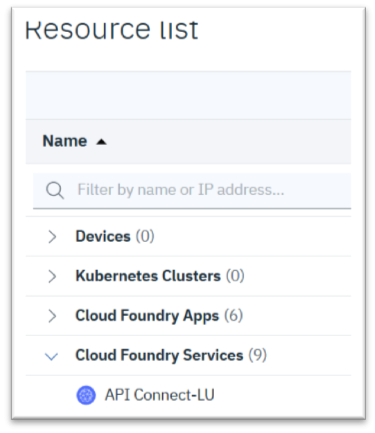

- Create an API Connect Product

  - A screen should appear with a large blue box in the middle.

  - Click the ">>" icon next to the word Dashboard (near the top right)

    >Icon.png" alt=">> Icon" width="20%">

  - Choose "Drafts"

  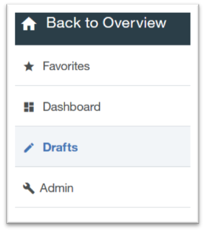

  - Click "Products"

  

  - Add a new product by clicking the "Add" button

  

  - A "New Product" menu screen should appear. Enter a title and click "Create Product"

   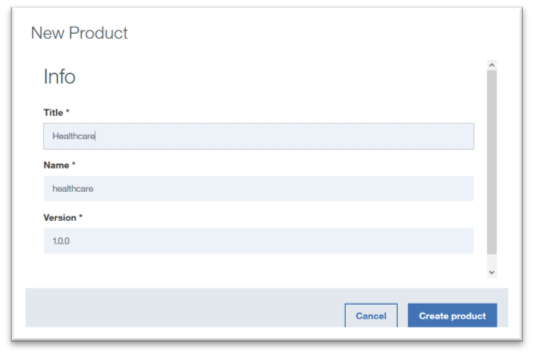

- Import the z/OS Connect API

  - You should be in the Drafts section again. If not, then return to it by clicking the ">>" near the top left corner and choosing "Drafts".

  - Click "APIs"

  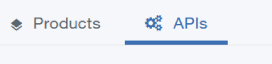

  - Add the API by choosing "Add" and "Import API from a file or URL"

  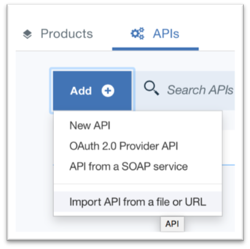

  - Enter the URI for the API document API you want to manage.   Ex: https://host:port/basepath/api-docs

    - Include credentials that have permission to view this document

    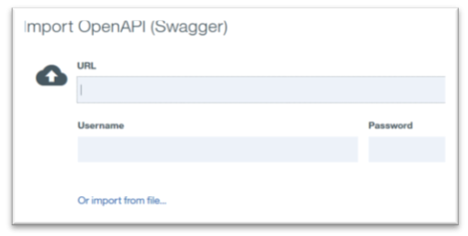

  - Click "Import"

    - _You will now be taken to a screen to provide additional details about the API and add additional security._

- Refine the Imported API

  - _You should see a screen similar to the one below. The default Title of the API is equivalent to the base path of the imported API._

  

  - Provide the Title and Name of your choice or keep the defaults

  - In the "Host" section, enter **\$(catalog.host)**

  - Scroll down to the "Schemes" section and un-check "http"

  

  - Near the top of the screen, click the word "Assemble"

  

  - Click "Create Assembly"

  

* There will be a scroll bar near the middle of the screen. Scroll down to the Policies section and click and hold "Invoke".  
  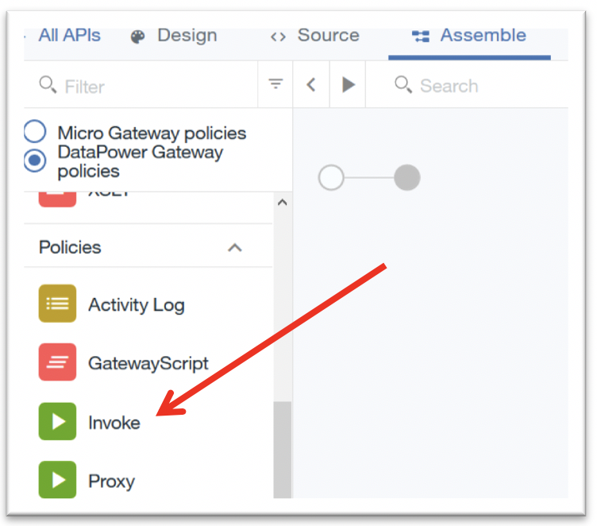

- Drag the invoke action to a place between the circles. A dotted box will appear where you can drop it.

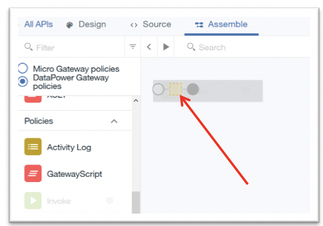

- _After you drop it, the area will look like this picture below:_

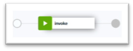

- Click the new "invoke" action. A list of options should appear on the right

  - Modify the URL to be: **https://host:port\$(request.path)**

  - Scroll down to the HTTP method and select "Keep"

- Add the API to a product
    Click “Design” at the top left.  
   
  Click the three vertical dots () near the top right and a pop-up menu will appear. Choose "Add to existing products"

  

- A new menu will appear entitled "Add to existing products". Click the check box next to the product name you created in earlier steps. The click "Add" (blue button at the bottom)

  

- Validate the API by clicking the circle with a checkbox () near the top right of the screen.   A message should appear that says "Validation Complete"

  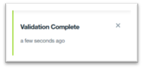

- Save the API by clicking the save icon ()

- Test the API Internally before Publishing

  - Click the triangle above the Invoke box

  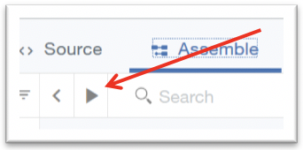

  - A menu will appear on the left. Under **Setup**, it specifies the name of the Catalog (_default in the example with value Test Catalog_) and the name of the Product that contains the API.

  - For safety, click "Republish Product" if it is recommended.

  

  - Further down in the same menu, click the triangle next to the word Operation to choose the part of the API to test.

  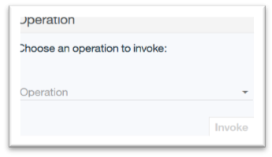
   
  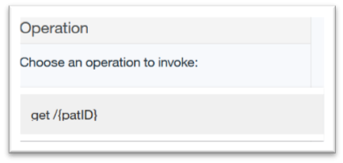

  - Enter the authorization credentials and test parameters and click "Invoke".

  

  - Scroll down to see the results of the test.

  
   
  

- Publish the Newly Created API to the Developer Portal

  - Click the ">>" icon near the top left of the screen

  >Icon2.png" alt=">>Icon2" width="30%">

  - Choose "Dashboard"

  - Click the picture that appears in the middle of the screen

  

  - View the newly published product in the catalog

  - To get to the portal, click the gear icon () then choose "Portal" on the left.

    - If you have not created one yet, you can do so now.

  - Open your instance of the Developer Portal (click the URL)

  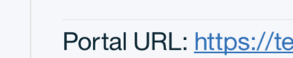

  - Login to the portal

  - Select "API Products" at the top of the page.

  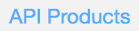

  - A list of products similar to the list of products in your previous view should appear

  

- Testing the API within the Developer Portal

  - Click on the Product to which the API belongs

  - A list of the APIs that belong to the product should appear on the left.

  

  - Select the API you created (and would like to test)

    - A testing screen should appear. Details about the API will be in the middle and the testing area will be on the right.

  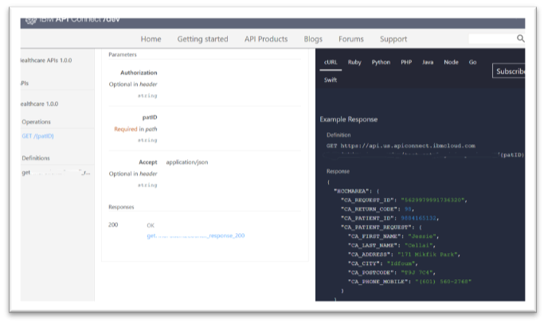

  - Scroll on the right to the area to enter credentials and test values

  

  - Click "Call operation"

  - Results should appear below the Call Operation button

  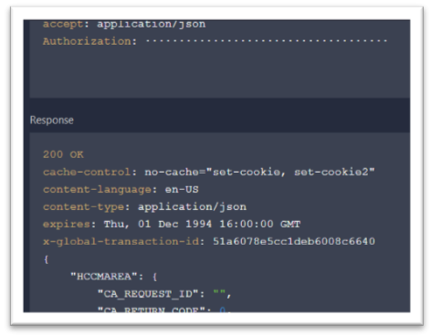
