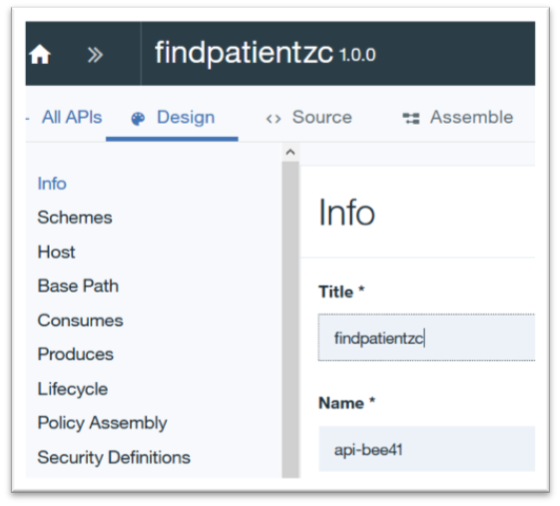
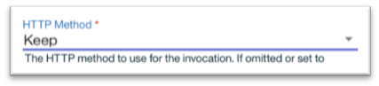

# CODE PATTERN IN PROGRESS.  DO NOT TRY TO COMPLETE.

# z/OS Connect & API Connect Code Pattern for Summit Health

This code pattern shows you how to expose data from a DB2 database and a CICS application through z/OS Connect and then create APIs to access that data with API Connect.

This work was done as part of the Summit Health set of code patterns, which demonstrate how cloud technology can access data stored on z/OS Systems. We needed a way to access the large amounts of data stored on a DB2 database and a CICS application. We used z/OS Connect and API Connect to expose the data through REST APIs. z/OS Connect provides a single, common way to unleash your existing market-differentiating assets on IBM with RESTful APIs. API Connect allows automated API creation, simple discovery of assets, self-service access for developers, and built-in security and governance. z/OS Connect was used first to expose the data from DB2 and CICS as REST APIs. Then API Connect was used to create a way for developers to easily access the APIs through an intuitive portal.

This code pattern is for people with an intermediate understand and experience working with Z Systems, z/OS and tools like z/OS Explorer.

When the reader has completed this code pattern, they will understand how to:

- Use z/OS Connect to expose CICS and DB2 Data with REST APIs
- Use API Connect to manage your APIs and create a portal for developers to access them

## Flow

This is how your APIs will be routed from your backend systems to a developer friendly portal.

1. z/OS Connect exposes the DB2 data through REST APIs
2. z/OS Connect exposes the CICS application data through REST APIs
3. API Connect connects to z/OS Connect and establishes a portal for developers to gain access to the APIs

# Steps

## 1. Install z/OS Connect

- Please refer to this [PDF](doc/source/zOSConnectEEV3GettingStarted.pdf) on how to install z/OS Connect. Go to page 8 for information on installation.

## 2. Create a z/OS Connect Project

- Open the Eclipse tool (IBM® Explorer for z/OS Aqua) in which you installed the z/OS Connect EE API Editor.

- Switch to the z/OS Connect Enterprise Edition perspective.

  - From menu bar, select **Window > Open Perspective > Other**

  - In the list of perspectives, select **z/OS Connect Enterprise Edition** and click **OK**.

  You are now in the **z/OS Connect Enterprise Edition** perspective, with related views and resources readily available.

- Create an API project.

- From the menu bar, select **File > New > z/OS Connect EE API Project**. The z/OS Connect EE API Project wizard opens.

  - Enter the project properties below, then click **Finish**.

| **Project property** |                                                                           **Description**                                                                            |                 **Naming Convention**                  |
| :------------------: | :------------------------------------------------------------------------------------------------------------------------------------------------------------------: | :----------------------------------------------------: |
|     Project name     |                                        Unique alphanumeric name for your project. This is the name of the project in Eclipse.                                        | A name that relates to the info you are trying to see. |
|       API name       |                                   The name of your API. This is the name by which the z/OS Connect EE server knows about this API.                                   |                    showpatientinfo.                    |
|      Base path       | The unique basePath attribute that specifies the root of all the resources in this API. This path is used by REST clients in the URI they send in to invoke the API. |                    /showPatientInfo                    |
|     Description      |                                           Optional field to provide a description of this API for documentation purposes.                                            |               "Retrieves pateient info."               |

- [Source](https://www.ibm.com/support/knowledgecenter/en/SS4SVW_2.0.0/com.ibm.zosconnect.doc/scenarios/ims_create_api.html)

## 3. Create the DB2 database and tables

- Assumptions/Prerequisites

  - You have DB2 v12 on z/OS (or DB2 v11 with REST enablement PTFs)

  - You have administrative authority to create database elements

  - You have knowledge of database and table creation commands

- Pre-work:

  - Create a database and table space within the DB2 z/OS subsystem

- DB2 Tables:

  - A. There are 12 tables that are used in the entire Summit Application (CICS native and Web):

  |   **Table**   |                                                                      **Description**                                                                       |
  | :-----------: | :--------------------------------------------------------------------------------------------------------------------------------------------------------: |
  |    PATIENT    |                                     Holds basic patient information (name, contact information, insurance card number)                                     |
  |     USER      |                                                      Holds patient credentials for login into system                                                       |
  |  MEDICATION   |                                                     General registry of medications and valid dosages                                                      |
  |  MEDITATION   |                                                   Record of any meditation sessions held with a patient                                                    |
  | PRESCRIPTION  |                                     Record of medications prescribed to a patient, with prescription period and dosage                                     |
  |   THRESHOLD   |                                      Most recent heart rate and blood pressure for a patient. One entry per patient.                                       |
  |   HEARTRATE   |                                                Log of patient heart rate when measured at a doctor's visit                                                 |
  | BLOODPRESSURE |                                              Log of patient blood pressure when measured at a doctor's visit                                               |
  |    SESSION    |                                                  Log of brain activity measurements taken during analysis                                                  |
  | APPOINTMENTS  |                                  Record of appointments for each patient (including doctor's name, specialty and reason)                                   |
  |   ALLERGIES   |                                                   List of any allergies a patient has and when they were                                                   |
  | OBSERVATIONS  | Log of patient measurements (such as height and weight), lab results (like cholesterol and blood sugar) and questionnaire answers (such as smoking status) |

- Seven (7) of the tables are used in the Web Interface:

  - PATIENT

  - USER

  - MEDICATION

  - PRESCRIPTION

  - APPOINTMENTS

  - ALLERGIES

  - OBSERVATIONS

- Create the tables for the functions that will be implemented in the Healthcare system.

  - The tables should be created in the table space that was defined to contain the Healthcare tables

  - Once the database and tables are created, a BIND needs to take place to connect the CICS application and the database.

- The commands for creating the database tables are listed in this [PDF](doc/source/CreateTableStatements.pdf)

## 4) Populate DB2 database with Synthea data

- Visit this [code pattern](https://developer.ibm.com/patterns/transform-load-big-data-csv-files-db2-zos-database/) for the instructions on populating your DB2 database with data from the Synthea tool

## 5) Expose DB2 data through z/OS Connect

## 6) Create CICS Application

- A sample CICS application is included in this code pattern. The application is known as HCAZ. It is a simple CICS application for inputing and retrieving healthcare information.

- The source code is included in the [HCAZ_Source](HCAZ_Source) folder.

- The source code includes JCL files to install the application. Some changes may need to be made to the JCL depending on your installation. If you have any questions ask your organization's zSystem Programmer or a zSystem Developer.

## 7) Expose CICS Application data through z/OS Connect

## 8) Create API Connect Instance

- Create an IBM Cloud Account

  - [Click here](https://cloud.ibm.com/registration) to go to the IBM Cloud registration page.

  - Enter your email, first name, last name, Country or Region, and the password you would like to use.

  

- Create an API Connect Instance

  - From the IBM Cloud Dashboard, click on **Catalog**.

  - In the search bar tyep **"API Connect"** and hit **enter**.

  - Click on the API Connect card.

  - Name the service. Choose a location to deploy in (Choose the locatino closest to you). Leave the organization and space at the defaults. Scroll down and select the **"Lite"** plan. The click the **Create** button.

  

## 9) Importing and Managing an API from z/OS Connect in API Connect

### Pre-requisites

This part assumes that an API has been created using z/OS Connect. The requirements for managing the API using API Connect are:

1. An IBM Cloud Account
2. The API Connect Feature enabled on the IBM Could Account
3. Access to the API description file (swagger.json) ass0ciated with the API or the URL and credentials to reach the API description document online.

### Background

The screen shots used in this part are based on a IBM Cloud hosted instance of API Connect and will be calling a previously created API (that was created with z/OS Connect).

Below is a pictorial view of z/OS Connect and API Connect working together. The green boxes represent Open API Specification (aka Swagger) documents.

### Steps

- Login to you IBM Cloud account if you are not already logged in.

- Navigate to API Connect

  - Under "Resource List", click the icon next to "Cloud Foundry" Services

  - Choose your API Connect Service

  

- Create an API Connect Product

  - A screen should appear with a large blue box in the middle.

  - Click the ">>" icon next to the word Dashboard (near the top right)

  

  - Choose "Drafts"

  

  - Click "Products"

  

  - Add a new product by clicking the "Add" button

  

  - A "New Product" menu screen should appear. Enter a title and click "Create Product"

  

- Import the z/OS Connect API

  - You should be in the Drafts section again. If not, then return to it by clicking the ">>" near the top left corner and choosing "Drafts".

  - Click "APIs"

  

  - Add the API by choosing "Add" and "Import API from a file or URL"

  

  - Enter the URI for the API document API you want to manage.   Ex: https://host:port/basepath/api-docs

    - Include credentials that have permission to view this document

    

  - Click "Import"

    - _You will now be taken to a screen to provide additional details about the API and add additional security._

- Refine the Imported API

  - _You should see a screen similar to the one below. The defualt Title of the API is equivalent to the base path of the imported API._

  

  - Provide the Title and Name of your choice or keep the defualts

  - In the "Host" section, enter **\$(catalog.host)**

  - Scroll down to the "Schemes" section and uncheck "http"

  

  - Near the top of the screen, click the word "Assemble"

  

  - Click "Create Assembly"

  

  - There will be a scroll bar near the middle of the screen. Scroll down to the Policies section and click and hold "Invoke".

  

  - Drag the invoke action to a place between the circles. A dotted box will appear where you can drop it.

  

  - _After you drop it, the area will look like this picture below:_

  

  - Click the new "invoke" action. A list of options should appear on the right

    - Modify the URL to be: **https://host:port\$(request.path)**

    - Scroll down to the HTTP method and select "Keep"

    

  - Add the API to a product   Click the three vertical dots () near the top right and a pop-up menu will appear. Choose "Add to existing products"

  

  - A new menu will appear entitled "Add to existing products". Click the check box next to the product name you created in earlier steps. The click "Add" (blue button at the bottom)

  

  - Validate the API by clicking the circle with a checkbox () near the top right of the screen.   A message should appear that says "Validation Complete"

  

  - Save the API by clicking the save icon ()

- Test the API

  - Click the trianfle above the Invoke box

  

  - A menu will appear on the left. Under **Setup**, it specifies the name of the Catalog (_default in the example with value Test Catalog_) and the name of the Product that contains the API.

  - For safety, click "Republish Product" if it is recommended.

  

  - Further down in the same menu, click the triangle next to the word Operation to choose the part of the API to test.

  

  

  - Enter the authorization credentials and test parameters and click "Invoke".

  

  - Scroll down to see the results of the test.

  

  

- Publish the Newly Created API to the Developer Portal

  - Click the ">>" icon near the top left of the screen

  

  - Choose "Dashboard"

  - Click the picture that appears in the middle of the screen

  

  - View the newly published product in the catalog

  - To get to the portal, click the gear icon () then choose "Portal" on the left.

    - If you hace not created on yet, you can do so now.

  - Open your instance of the Developer Portal (click the URL)

  

  - Login to the portal

  - Select "API Products" at the top of the page.

  

  - A list of products similar to the list of products in your previous view should appear

  

- Testing the API within the Developer Portal

  - Click on the Product to which the API belongs

  - A list of the APIs that belong to the product should appear on the left.

  

  - Select the API you created (and would like to test)

    - A testing screen should appear. Details about the API will be in the middle and the testing area will be on the right.

  

  - Scroll on the right to the area to enter credentials and test values

  

  - Click "Call operation"

  - Results should appear below the Call Operation button

  
